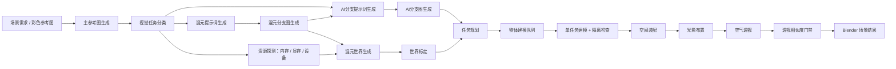

# 🤖 白歌的AI讨论组 · v2.1

一个本地运行的全栈 AI 协作平台 —— 普通对话 / 多 AI 对战 / 工作流编排 / 思维导图 / 摄影工具 / **AI 一键 3D 建模**（v2.1 全面进化到 Codex CAD 范式：Plan-Execute-Reflect + 真·文件系统 + bpy 检索 + 多角色协作 + bmesh 模板库）。

## 开源版说明

- GitHub: [YanKuiShen/ai-chat](https://github.com/YanKuiShen/ai-chat)
- License: MIT（第三方依赖、Blender 插件生态、混元 3D 模型与其权重文件遵循各自上游许可）
- 本仓库不包含真实 API Key、用户会话、运行记录、数据库、构建产物、Hunyuan3D 权重和本地缓存。
- 真实密钥只允许放在本机配置里，例如 `.env` 或应用内生成的 `data/configs.json`，这些文件已在 `.gitignore` 中排除。

## 实时渲染工作流

当前流程以结果为导向：白膜节点已移除，混元和 AI 分支都直接读取彩色主参考图；视觉任务分类结果会同时进入混元提示词和 AI 分支提示词，AI 分支也会读取混元分支图生成结果。

## 隐私与大文件边界

开源提交前请保留这些文件在本地，不要上传：

- `.env`、`.env.*`
- `data/configs.json`、`data/sessions.json`、`data/chat.db*`
- `data/asset_index.json`（本地素材/PolyHaven 缓存索引，可能包含本机路径）
- `data/realtime_workflows/`
- `3d/Hunyuan3D-2-weights/`、`3d/Hunyuan3D-2mini-weights/`
- `node_modules/`、`dist/`、`build/`、日志、缓存和虚拟环境

需要本地环境变量时复制 `.env.example` 为 `.env`，再填入自己的端口、私有服务地址或 API Key。

## 🌟 v2.1 头号卖点：🧠 Codex CAD 范式（Plan-Execute-Reflect + 多角色专家协作 ⭐）

参考 [LangGraph](https://github.com/langchain-ai/langgraph) / [Anthropic Computer Use](https://www.anthropic.com/news/claude-3-5-sonnet) / [Claude Code](https://docs.anthropic.com/en/docs/claude-code) / Codex CAD 等业界 agentic 范式，**一次性补齐 v2.0 MCP Agent 长时任务的五大缺失**：

| Phase | 子能力 | 治什么痛点 |
|---|---|---|
| **A · Plan-Execute-Reflect** | 5 个客户端工具 `plan_create` / `plan_update_step` / `plan_get` / `reflect` / `mark_done`（前端 JS 直接执行，0 网络往返毫秒返回） | 治【漂移】Round 10 时 AI 已经忘了 Round 1 用户提的 5 个具体要求 |
| **B · 真·文件系统** | 5 个客户端工具 `workspace_create_session` / `workspace_write_file` / `workspace_read_file` / `workspace_list_files` / `workspace_delete_file` + `~/Desktop/ai-chat-workspace/` 时间戳化 session 子目录 + 6 个 HTTP 端点（路径穿越攻击拦截 30/30 全过） | 治【外部记忆缺失】跨会话 plan/反思/bpy 草稿全飘在 LLM 上下文里，用户也无法 Finder 看见改写 |
| **C · bpy API 实时检索** | `scripts/bpy-cheatsheet.json` 192 条精选 bpy/bmesh/GN API（29 个类别含 14 条 pitfall 反踩坑）+ `search_bpy_docs` 工具 + 加权打分模糊搜 | 治【prompt 膨胀】原 6 段反踩坑速查 ~3000 tokens 缩减成"调 search_bpy_docs"一句话指引，节省 80%+ system prompt 配额 |
| **D · 多角色专家协作** ⭐ | Planner / Modeler / Critic 三角色独立 API + 模型（推荐：Claude Opus 4 / Claude Sonnet 4 / Gemini 2.5 Pro 三模型分工） | 治【单一模型短板】推理/工具调用/视觉理解三种能力对模型要求差异巨大，单一模型永远拖后腿 |
| **E · bmesh / Geometry Nodes 模板库** | 10 个预制模板（沙发/餐椅/茶几/书架/花瓶/杯子/盆栽/枕头/相框/墙体）+ `apply_template` / `list_templates` + Mustache 参数渲染 | 治【AI 写复杂建模翻车】预制模板一行调用拿到经过验证的完整 bpy 脚本，比 AI 自己写稳得多 |
| **F · aichat_bridge 插件 2.1.0** | 3 新 HTTP 端点 `GET /blend_summary`（token-friendly 场景概览 < 2KB）+ `POST /bookmark_state` / `POST /restore_state`（**软回滚**机制） | 治【没有撤销】Modeler 改场景越改越烂时，Critic 一键回滚到 bookmark 之前的状态 |

**核心机制**：MCP system prompt 强制 AI **第一步必调** `plan_create` 拆 3~8 个步骤 → 主循环按 round 切换三角色 system prompt → Planner 出 plan.md → Modeler 调原子工具实现并 `plan_update_step` 更新进度 → Critic `get_viewport_screenshot` 审图 + `reflect` 写反思 → Modeler 修复轮 → **`mark_done` 显式退出**（治旧版本撞 MAX_ROUNDS=30 的不可靠性）。

**总工具数**：v1.10.0 的 16 个 Blender 原子工具 → v2.1.0 **29 个**（+13 个客户端工具）。

最新公开说明见 [`CHANGELOG.md`](./CHANGELOG.md)。旧版本长文已保留在维护者本地归档，不再进入 GitHub 仓库。

> ⚠️ **v2.1.0 用户操作提醒**：装完 v2.1.0 dmg 后**必须**在 Blender 里手动重装一次新的 `aichat_bridge.zip`（旧 2.0.4 插件不会因 dmg 升级自动覆盖）。重启 Blender 后通过【🩺 测试连接】确认 `插件 ≥ 2.1.0` + `features` 含 `blend_summary` / `bookmark_state` / `restore_state` 三个新端点。

---

## 🚀 快速启动

**双击** `启动.command` 即可。浏览器会自动打开 http://localhost:3456。

## ✨ 主要功能

### 💬 普通对话 / ⚔️ 多 AI 对战
- 多 API 配置（OpenAI / Claude / DeepSeek / Gemini / Qwen 等）
- 多模态对话（图文混合 / PDF / DOCX 文件解析）
- 多 AI 互相对战（≥2 个参与者自由组合）

### 🔄 工作流编排
- 拖拽式可视化节点（输入 / AI / 通用三类节点，自由连线）
- 节点级运行（从任意节点开始往下游跑，上游用缓存）
- 图生图链路自动识别（节点间图片传递）

### 🗂 思维导图 / 大纲笔记
- 幕布风格大纲编辑（Enter/Tab/Shift+Tab 流畅缩进）
- 大纲 ↔ 思维导图一键切换（markmap 渲染 + SVG 导出）
- AI 一键根据主题生成大纲 / 从历史对话总结成导图

### 📸 摄影工具
- 照片墙（情绪板 / 自由拖拽）
- 图像分析（视觉大模型反推 prompt + 拍摄参数）
- 拍摄备忘录（AI 生成器材 / 分镜 / 注意事项清单）

### 🧊 一键 3D 建模流水线
聊天记录 → AI 总结场景描述 → 出四宫格参考图 → 视觉模型演算 → 直出 Blender Python 代码 → 一键推送到 Blender。

### 🎬 智能 Agent 实时渲染（3 种生成模式）

| 模式 | 说明 | 依赖 |
|------|------|------|
| ⚡ **AI 从零生成** | 纯 LLM 写 bpy 代码，速度快，几何粗糙 | 仅 `aichat_bridge` 1.1.0+ |
| 🎨 **PolyHaven 网络资产** | 1500+ CC0 模型 / 800+ HDRI 真实下载，首次需 30~120s | 仅 `aichat_bridge` 1.1.0+ |
| 🧠 **Codex CAD 范式（MCP Agent v2.1）** ⭐ | LLM 三角色协作（Planner/Modeler/Critic）多轮 tool_call 边看边干 + 文件系统 + bpy 检索 + 模板库 + 软回滚（v2.1 头号卖点） | `aichat_bridge` **2.1.0** + 原生支持 OpenAI tool calling 的模型（推荐 Claude Sonnet 4 / Claude Opus 4 / Gemini 2.5 Pro / GPT-4o / DeepSeek-V3） |

3 种模式完全互斥互不影响，不勾 MCP 就不需要升级插件到 2.1.0。

### 📺 实时视口监测（v1.9.7）
智能 Agent 实时渲染面板内的折叠卡片，1/3/5/10 秒频率档位 + 400/600/800px 分辨率档位，让你"看 Blender 是怎么一步步长出来的"。历史回看 12 张缩略图。

---

## 📖 使用说明

### 第一步：配置 API

1. 点击左下角 **⚙️ 设置**
2. 填入名称 / Base URL（如 `https://xxx.com/v1`）/ API Key
3. 点击 **添加** → 在 API 列表点【筛选模型】只勾选你常用的（避免下拉框爆）

### 第二步：新建对话

1. 点击左上角 **+ 新建**
2. 选择上方的 API 和模型
3. 开始聊天

### 第三步：体验 v2.1 Codex CAD 范式

1. 顶部切到 **摄影工具** 模式 → 进入 **🎬 智能 Agent 实时渲染**
2. **必须先升级 Blender 插件到 2.1.0**：右侧【📥 一键导出插件 zip 到桌面】→ Blender Edit → Preferences → Add-ons → 卸载旧版（如果有）→ Install 桌面 zip → 勾选启用 → 重启 Blender
3. 在【🩺 测试连接】确认 🟢 已连接 · 插件 ≥ 2.1.0 + features 含 `blend_summary` / `bookmark_state` / `restore_state`
4. 「生成方式」勾选 **🧠 Codex CAD 范式（MCP Agent）**（紫色卡片）
5. 在「🎭 v2.1.0 Phase D：多角色专家协作」展开三个子卡片，分别给 Planner / Modeler / Critic 选 API + 模型（可全选同一个模型起步，慢慢调优）
6. 写场景需求 → 点【🎬 开始实时建模 ▶】
7. 看「📋 Plan-Execute-Reflect 进度」+「📂 AI 工作目录」+「🛠 工具调用历史」三块面板实时滚动，每条带角色 badge `[🧠 Planner]` / `[🛠 Modeler]` / `[👁 Critic]`
8. 完事去 `~/Desktop/ai-chat-workspace/{session}/` 看 plan.md + scripts/*.py + reflections.jsonl 等产物

---

## 🛠 技术栈

- **后端**：Node.js + Express + SQLite
- **前端**：原生 ES 模块 + marked.js + drawflow.js + markmap
- **桌面**：Electron（macOS DMG / Windows NSIS 双平台打包，arm64 + x64 共 4 包）
- **Blender 插件**：Python（`aichat_bridge` **2.1.0**，端口 9876，主线程 timer + threading.Event 同步执行，含 19 个 MCP 工具 / 3 个 v2.1.0 新端点 / 内存快照 + 软回滚）
- **运行端口**：3456（自动顺延）
- **数据存储**：`data/chat.db`（本地 SQLite）+ `~/Library/.../aichat_polyhaven_cache/`（PolyHaven 资产缓存）+ `~/Desktop/ai-chat-workspace/`（AI 工作目录，v2.1.0 Phase B 新增）
- **AI 知识库**：`scripts/bpy-cheatsheet.json` 192 条 bpy/bmesh/GN API 精选条目 + `scripts/bmesh-templates.json` 10 个 bmesh/GN 模板（v2.1.0 Phase C/E 新增）

---

## 📦 当前版本说明

仓库只保留当前公开版本说明，详见 [`CHANGELOG.md`](./CHANGELOG.md)。完整历史发布记录保存在维护者本机归档，不随开源仓库发布。

---

## 🐛 反馈

BUG 报告邮箱：1455714025@qq.com

---

## 📜 致谢

- [LangGraph](https://github.com/langchain-ai/langgraph) / [Anthropic Computer Use](https://www.anthropic.com/news/claude-3-5-sonnet) / [Claude Code](https://docs.anthropic.com/en/docs/claude-code) / Codex CAD：v2.1 Plan-Execute-Reflect + 多角色协作 + 真·文件系统范式参考
- [blender-mcp](https://github.com/ahujasid/blender-mcp)：MCP 工具集设计 + Agent 工作范式 + 资产策略参考
- [PolyHaven](https://polyhaven.com)：1500+ CC0 模型 / 800+ HDRI / 9 套 PBR 贴图（免授权商用）
- OpenAI tool calling [流式协议文档](https://platform.openai.com/docs/guides/function-calling)：MCP Agent 循环 `delta.tool_calls` 累加规则的标准
